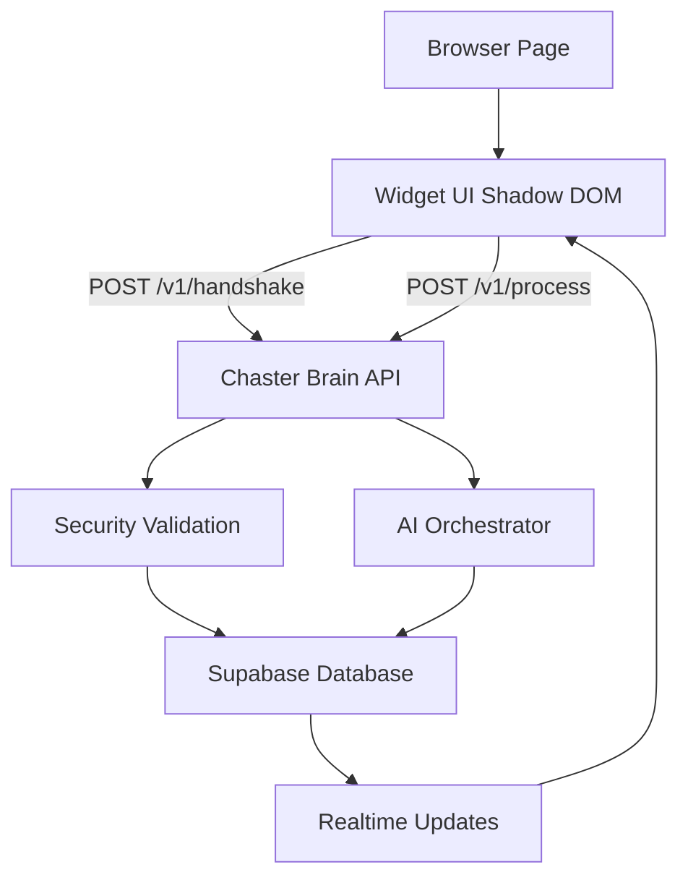

# Chaster Widget System Guide (Plain English)

This guide explains the full widget system without requiring coding knowledge.

---

## 1) Big Picture

Think of the system as 4 parts:

1. **Website Page** (your browser page, local or client site)
2. **Widget UI** (the floating chat box you see)
3. **Security + AI API** (`chaster-brain` backend)
4. **Supabase Database** (stores tenant config, messages, states)

Flow:

1. Page loads widget script.
2. Widget asks backend for a secure session (`/v1/handshake`).
3. User sends message -> widget calls backend (`/v1/process`).
4. Backend validates security, runs AI logic, returns response.
5. Widget renders response.
6. Optional realtime updates (human handover / new messages) come from Supabase.

---

## 2) Where Everything Lives

## Repository Root

- `chaster-widget/` -> frontend widget package (what user sees)
- `chaster-brain/` -> backend API/security/orchestration
- `PROJECT_CONTEXT.md` -> project-level context notes
- `WIDGET_SYSTEM_GUIDE.md` -> this file

## Widget Side (`chaster-widget/`)

- `src/index.tsx`
  - Widget entrypoint.
  - Exposes `window.ChasterWidget.init(...)`.
  - Auto-boot support from `<script data-app-id="...">`.
- `src/App.tsx`
  - Main premium chat UI behavior: intake, messages, typing, minimize, send, transitions.
- `src/securityClient.ts`
  - Calls `/v1/handshake` and `/v1/process`.
  - Stores session token in memory/sessionStorage.
- `src/sanitize.ts`
  - Cleans user input before sending.
- `src/realtime.ts`
  - Subscribes to Supabase realtime updates.
- `src/styles.ts`
  - Widget visual styles (isolated in Shadow DOM).
- `dist/chaster-widget.iife.js`
  - Built script used by `widget.html` or client websites.
- `widget.html` (or demo page)
  - Local test page that loads the widget bundle.

## Backend Side (`chaster-brain/`)

- `app/main.py`
  - API routes.
  - Important routes:
    - `POST /v1/handshake`
    - `POST /v1/process`
    - `POST /v1/gateway/message` (existing route)
- `app/gateway/service.py`
  - Security validation:
    - tenant checks
    - origin checks
    - HMAC signature checks
    - replay/nonce/timestamp checks
- `app/models.py`
  - Request/response data shapes.
- `app/security/replay_guard.py`
  - Blocks duplicate/old requests.
- `app/config.py`
  - Reads env vars (`.env`).
- `tests/test_gateway_api.py`
  - Endpoint tests.

---

## 3) Security Model (Simple)

Each request is accepted only if:

1. `app_id` exists in `public.app_configurations`
2. `tenant_id` matches the app config
3. browser origin is in `allowed_origins`
4. HMAC signature is valid
5. timestamp is fresh + nonce not reused

If any of these fail, backend returns a clear error (`Origin not allowed`, `Unknown app_id`, etc.).

Extra guest safety rule:

- Every new guest intake (name/email) creates a fresh conversation session.
- No previous history is loaded for the same email unless identity is cryptographically verified.

---

## 4) Database Tables You Touch Most

- `public.app_configurations`
  - App identity + allowed origins + hmac secret
- `public.tenants`
  - Tenant IDs
- `public.support_cases`
  - Includes handover state (`ai_handling`)
- `public.conversations`
  - Conversation records
- `public.messages`
  - Message stream

---

## 5) Local Run Checklist

1. Start backend:
   - `cd chaster-brain`
   - `python -m uvicorn app.main:app --reload --port 8010`
2. Build widget:
   - `cd chaster-widget`
   - `npm run build`
3. Serve repo locally:
   - from repo root: `npx serve . -l 8080`
4. Open page:
   - `http://localhost:8080/chaster-widget/widget.html`

---

## 6) Most Common Errors and Meaning

- `Failed to fetch`
  - Usually browser cannot reach backend or CORS blocked.
- `Origin not allowed`
  - Origin missing in `app_configurations.allowed_origins`.
- `Unknown app_id`
  - `app_id` missing in `app_configurations`.
- `Replay guard rejected request`
  - Timestamp too old or nonce reused.
- `Invalid signature`
  - HMAC secret/signing payload mismatch.
- `guest_name and guest_email are required for anonymous intake`
  - Widget must submit intake form first before opening guest chat session.

---

## 7) Visual Diagram

---

## 8) What You Can Ask Me Next

- "Show me exactly where to change widget text/colors."
- "Show me exactly where to change security strictness."
- "Show me exactly where AI response behavior is decided."
- "Give me a one-page troubleshooting checklist."

